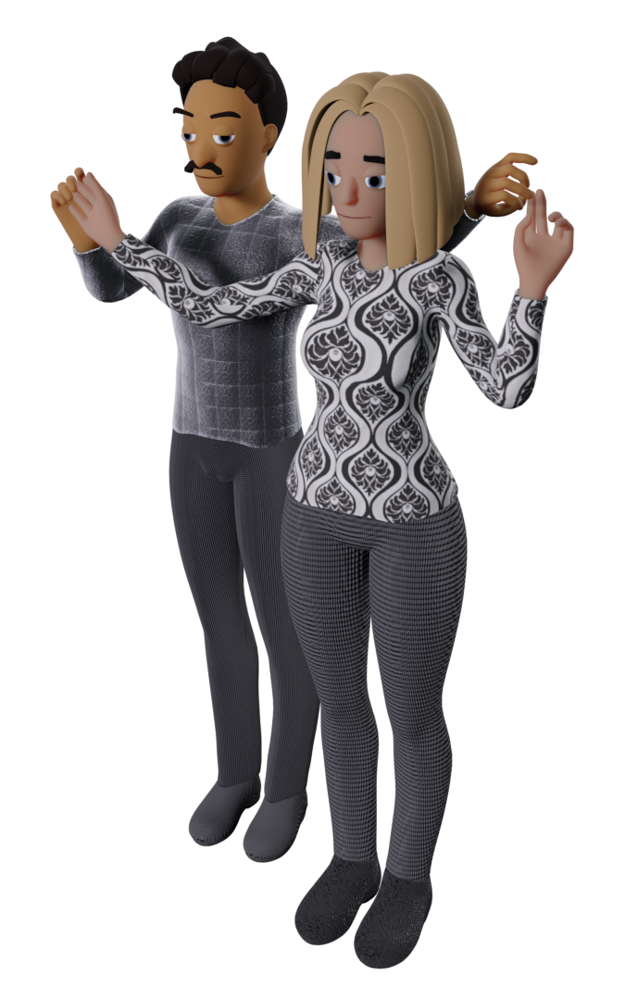

Title: Salsa Dance Pairings
Date: 2021-03-20 12:34:56
Modified: 2021-03-20 12:48:00
Category: blog
Tags:
Slug: partner-pairings
Authors: Marisol Enchufa
Summary: This article presents nine pairings of salsa dance couples for the readers' consideration.  Vote for your favorite!

# WHAT
Dear reader, I have a favor to ask of you. I am redoing all of the illustrations my books. I am about to re-render all of the illustrations with new models.  Could you kindly take a moment and tell me your favorite models by tweeting me at **@salsahandbook*?  Your feedback would be appreciated very much.

> For the new reader who is unfamiliar with my books, I've published several reference books about salsa dance. Links are provided below in the More Reading section. 

# WHY
I illustrated those books using a quick and easy posing tool called Magic Poser. This was the best posing tool for what I needed at the time. However the salsa handbooks have now outgrown that tool.

> I very highly recommend Magic Poser. It provided pluggable body, hair, and wardrobe combinations, allowed posing two models simultaneously, and was very easy to use. The inverse kinematics of their rigged characters is excellent. I was able to create all of those poses using touch gestures on an iPhone 5s.

It was time to bite the bullet and learn a software that could provide flexibility I wanted to have to improve these illustrations. I have finally ramped up the rather steep learning curve on that software.  I am now in the final stage. The next step is to choose from among several candidate models to pick the ones to use for re-rendering the illustrations.

# PICK YOUR FAVORITE!

**Please pick your favorite pairing from the following list!**

* Tweet your selection to **@salsahandbook**
* Email your feedback to **salsahandbook** (at) **gmail** (dot) **com**. 

###Thank you!

# Pairing 1:

# Pairing 2:

# Pairing 3:

# Pairing 4:

# Pairing 5:

# Pairing 6:

# Pairing 7:

# Pairing 8:

# Pairing 9:

---------

### More Reading

To learn more about salsa dance check out these books:

1. Illustrated Handbook of Salsa Dance: **Positions**
    * [Apple Edition](https://books.apple.com/us/book/illustrated-handbook-of-salsa-dance-positions/id1513830159)
    * [Kobo Edition](https://www.kobo.com/us/en/ebook/illustrated-handbook-of-salsa-dance)
    * [Kindle Edition](https://www.amazon.com/Handbook-Salsa-Dance-Marisol-Enchufa-ebook/dp/B084FBB468)
    * [Paperback Edition on Amazon](https://www.amazon.com/gp/product/B086Y7D5NT)
    * [Google Play](https://books.google.com/books/about?id=yBXmDwAAQBAJ)

2. Illustrated Handbook of Salsa Dance: **Patterns**
    * [Apple Edition](https://books.apple.com/us/book/illustrated-handbook-of-salsa-dance-patterns/id1513834201)
    * [Kobo Edition](https://www.kobo.com/us/en/ebook/illustrated-handbook-of-salsa-dance-1)
    * [Kindle Edition](https://www.amazon.com/Illustrated-Handbook-Salsa-Dance-Patterns-ebook/dp/B084G82R7M)
    * [Paperback Edition on Amazon](https://www.amazon.com/gp/product/B086Y7R97V)
    * [Google Play](https://books.google.com/books/about?id=1BXmDwAAQBAJ)

3. Illustrated Handbook of Salsa Dance: **Butterfly Patterns**
    * [Kindle Edition](https://www.amazon.com/gp/product/B087C9C4CP)

