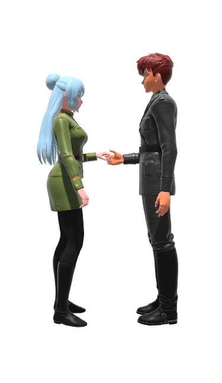
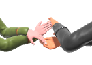
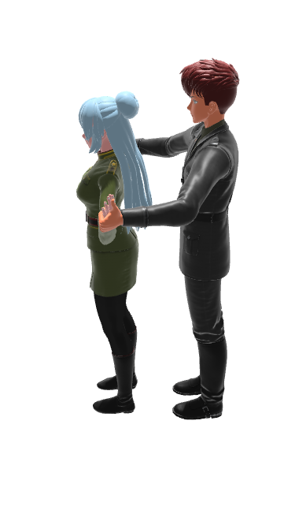

Title: Salsa Dance Positions
Date: 2020-08-01 12:34:56
Modified: 2020-08-01 12:34:56
Category: blog
Tags:
Slug: salsa-positions
Authors: Marisol Enchufa
Summary: This article explains the salsa dance position.

# What is a salsa dance position
The salsa dance position is a fundamental element of partner dance. Salsa dance elements include the following:

* Steps
* Handholds
* Turns
* Combs
* Stylings
* **Positions**
* Patterns
* Combinations

A salsa dance position comprises the orientation of the dancers with respect to each other and the handhold. For more about handholds, see [this article, which is all about salsa dance handholds](https://salsahandbook.github.io/output/salsa-handholds.html).

Aspects of dancer orientation include what direction each dancer is facing, whether the dancers are in a handhold, at what level are the hands held, and the direction of eye gaze. 

We refer to the leader as _Leader_ and to the follower as _Follower_.

_Facing Each Other_ is a common orientation.  Here, the dancers are apart and facing each other. _Apart_ means that they are not touching. That also implies that they are not holding hands. That is, they are not in a [handhold](https://salsahandbook.github.io/output/salsa-handholds.html).

Here is a more advanced position where the dancers are _Facing Same Direction_, _Side By Side_, and with _Leader On Left_. 

# Why the dance position is important
Salsa dance is a pleasing transition through a series of positions. Every salsa dance pattern begins and ends in a dance position. Expert salsa dancers know how to get into and out of myriad salsa dance positions in interesting ways. 

Knowing how to transition through positions in fun and pleasing ways can help increase your salsa dance repertoire.  This is facilitated by knowing your dance positions.

# How the dance position fits into patterns and combinations
For many salsa dance enthusiasts, salsa dance is the aesthetically pleasing progression through a series of dance combinations over the course of a song. A salsa dance combination is comprised of two or more salsa dance patterns, each pattern covering two bars of music. Every salsa dance pattern begins and ends in a dance position. Therefore, the salsa dance pattern is a pleasing transition from a start position to an end position over eight beats of music. Because salsa dance is made up of combinations, and combinations are made up of patterns, and a dance pattern begins in a position and ends in a position, one can view salsa dance positions as a fundamental building block of the salsa dance combination.

# More examples of basic salsa dance positions

### Half Closed Position 

The dancers are facing each other, with Leader's right hand on Follower's left upper back, and Follower's left hand on Leader's left shoulder.

### Open Position

An "open position" is a class of positions where the dancers are not in a closed position, typically in a handhold, and typically facing each other. Because this particular open position is so common it is often referred to simply as *Open Position. The dancers are holding both pairs of hands. This handhold is also referred to as a parallel handhold.

### Half Open Right to Left
This is a variation of the Open Position where the dancers are holding only one pair of hands. Leader's right hand is holding Follower's left hand.

### Half Open Left to Right
This is another variation of the Open Position where the dancers are holding only one pair of hands. Leader's left hand is holding Follower's right hand.

### Handshake
In this position the dancers are facing each other, in a right to right handhold. This is one of those positions that is named after the handhold. However, it is possible to be in an orientation other than the one shown here. See the Salsa Handbooks for examples.

### Reverse Handshake
In this position the dancers are facing each other, in a left to left handhold.

### Crosshold
This is another position that is named after the handhold. This is a type of open position where the dancers facing each other, holding both pairs of hands, and where the hands are crossed.  The handhold is right hand to right hand, left hand to left hand, with Leader's right hand over Leader's left hand.

Here is how this position appears from an overhead view:

Leader can remember this as "left to left, right to right, right over left".

### Reverse Crosshold
This is a variation of the Crosshold, where Leader's left hand is over Leader's right hand. Leader can remember it as "left to left, right to right, left over right".

Here is how this handhold appears from an overhead view:

Many positions have inversions which mirror the original position, or where the handhold is inverted. This is why it is helpful to know how to breakdown a position into its parts, so that when introduced to a new position you can realize that it is a variation of a position that you already know.

### Crossed Parallel Hold

Here is one of the more unusual positions. It uses a kind of parallel hold but where the hands are crossed.  The handhold is left to right and right to left, with Leader's left hand over Leader's right hand.

> Note on naming: truthfully there doesn't seem to be a standard name for this handhold. This is one of those handholds where it can be simpler to just explicitly describe the hold, as in "right to left, left to right, left over right". Or, for its inverse variation, as "left to right, right to left, right over left". The section below on Shorthand delves more into this topic.

Here is a closeup view:

Here is how this handhold appears from an overhead view:

You might ask, do people really get into that hold? Is it useful? The answer would be yes, and yes. This handhold can be entered when performing a double handed turn. The variation of this where the hold is inverted (Leader's right hand over Leader's left hand) is obtained when perfoming the double turn in the opposite spin direction.

## Applications

A simple handhold in a facing each other orientation can transform into another interesting position just by modifying the orientation of the dancers.

Here is a position involving a right to left, left to right hand hold at high level. This is essentially the same handhold as is used in the standard open position. Only the orientation of the dancers and the height level of the handhold has changed. If you guessed that this position can be obtained by a transition from the Open Position, you would be correct!

Here is a position involving a left to left, right to right handhold, where the dancers are facing the same direction, with Leader in back, and Follower in front.

Here is another application of the left to left, right to right handhold, which we already saw previously above. In this position the dancers are facing the same direction and side by side.

Here is yet another left to left, right to left handhold, where the dancers are facing the same direction and with Leader in front, Follower in back.

Because the last three positions are using the same handhold, you might guess that there is a way to transition from each of these positions to each of the others -- and you would be right. This is one of the fun aspects of salsa dance, figuring out how to enter and exit positions in interesting ways.

## Shorthand

There are many other positions not shown here. Many positions do not have commonly accepted names. Because there are so many possible positions it is useful to use a shorthand system for describing positions that do not have common names.  It is also useful for providing a standard terminology for introducing common positions that do have a standard name to new dancers who are still just learning the basics. The [Salsa Handbooks](https://salsahandbook.github.io/output/salsa-handbooks.html) on which this article is based use a shorthand system for referring to the dancers and their orientation. Those books provide a comprehensive overview of that shorthand notation system. This section gives a brief introduction to a subset of that shorthand notation.

* Facing Each Other (FEO)
* Facing Opposite Directions (FOD)
* Side By Side (SBS)
* Leader In Front (LIF)
* Leader In Back (LIB)
* Leader On Right (LOF)
* Leader On Left (LOL)
* Leader's Left Hand (LLH)
* Leader's Right Hand (LLH)
* Follower's Left Hand (FLH)
* Follower's Right Hand (FLH)
* Right to Right (R to R)
* Left to Left (L to L)
* Left to Right (L to R)
* Right to Left (R to L)
* Leader's right hand over Leader's left hand (LRH/LLH)
* Leader's left hand over Leader's right hand (LRH/LLH)

Imagine all the ways in which you can combine these orientations and handholds. That gives a hint as to the number of possible positions. It turns out that there are many many positions! For a comprehensive compendium of salsa dance positions, see the [Handbook of Salsa Dance: Positions](https://salsahandbook.github.io/output/salsa-handbooks.html), links to which are also given below. Although that handbook is comprehensive, it is still not exhaustive! There are other positions not included there.  That is why it is useful to have a system for breaking down a position into consitituent parts. This makes it possible to not only learn novel positions, but to invent new ones.

Here is a position where the dancers are in a handhold, and where the dancers are _Facing Same Direction_ (FSD), _Side By Side_ (SBS), and _Leader On Left_ (LOL). Leader's right hand is to Follower's right hand (_Right to Right_), and Leader's left hand is to Follower's left hand (_Left to Left_). 

Using the shorthand we can succinctly describe this position as _FSD SBS LOL, R to R, L to L_.

### Summary

All salsa dance patterns begin and end in a dance position. Having this insight makes it easier to assimilate a new dance pattern. A first step in breaking down a dance pattern is to observe how it begins and ends. Understanding the start and end position of a pattern makes it easier to learn the middle part of the pattern.

---------

### More Reading

To learn more about salsa dance check out these books:

1. Illustrated Handbook of Salsa Dance: **Positions**
    * [Apple Edition](https://books.apple.com/us/book/illustrated-handbook-of-salsa-dance-positions/id1513830159)
    * [Kobo Edition](https://www.kobo.com/us/en/ebook/illustrated-handbook-of-salsa-dance)
    * [Kindle Edition](https://www.amazon.com/Handbook-Salsa-Dance-Marisol-Enchufa-ebook/dp/B084FBB468)
    * [Paperback Edition on Amazon](https://www.amazon.com/gp/product/B086Y7D5NT)
    * [Google Play](https://books.google.com/books/about?id=yBXmDwAAQBAJ)

2. Illustrated Handbook of Salsa Dance: **Patterns**
    * [Apple Edition](https://books.apple.com/us/book/illustrated-handbook-of-salsa-dance-patterns/id1513834201)
    * [Kobo Edition](https://www.kobo.com/us/en/ebook/illustrated-handbook-of-salsa-dance-1)
    * [Kindle Edition](https://www.amazon.com/Illustrated-Handbook-Salsa-Dance-Patterns-ebook/dp/B084G82R7M)
    * [Paperback Edition on Amazon](https://www.amazon.com/gp/product/B086Y7R97V)
    * [Google Play](https://books.google.com/books/about?id=1BXmDwAAQBAJ)

3. Illustrated Handbook of Salsa Dance: **Butterfly Patterns**
    * [Kindle Edition](https://www.amazon.com/gp/product/B087C9C4CP)

