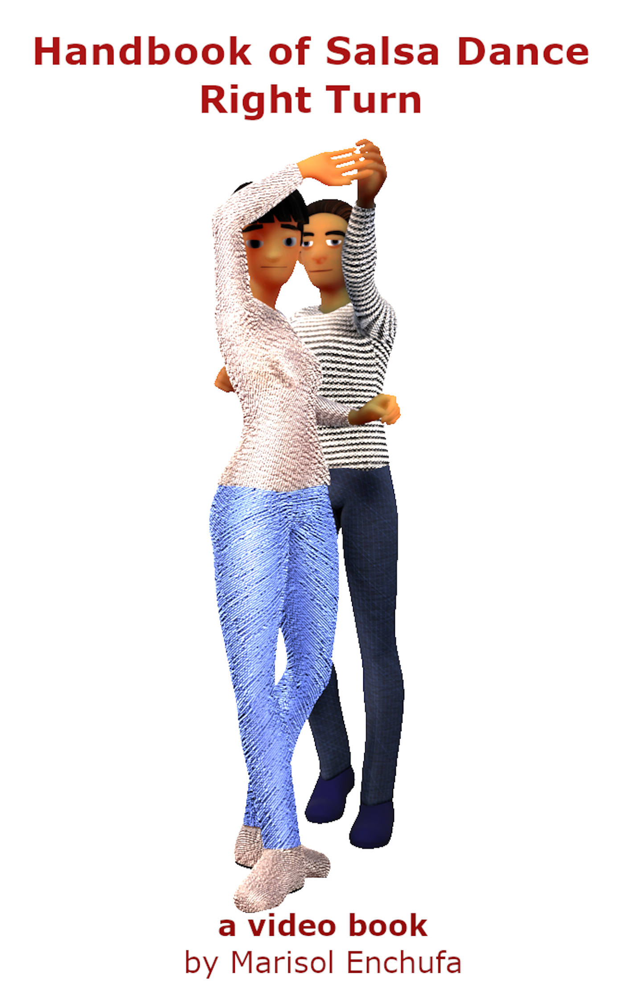

Title: Announcing new videobooks
Date: 2021-09-06 12:34:56
Modified: 2021-09-06 12:48:00
Category: blog
Tags:
Slug: videobooks
Authors: Marisol Enchufa
Summary: Announcing the new video book format and the first three editions.

# INTRODUCING THE VIDEOBOOK FORMAT

  
  
  

This format is an ebook that contains embedded videos. Each animated video demonstrates a dance element, such as a dance pattern, step, or handhold. Most dance elements are shown from more than one camera angle.

## Why the videobook?

The videobook is ideal for visual learners. Some people learn by watching a demonstration.  Some people learn best by imitating in real time.

## Scrubbable video
Each animation can be "scrubbed". Moving the cursor or playhead across the video timeline manually is called video scrubbing. Scrubbing is a great way to review the video at your own pace, something that can be a challenge to do with other video content.

## How to use video scrubbing?
It is super easy -- barely an inconvenience. All you need to do is move your cursor above the scrub bar and drag it in the desired direction to navigate through video clips.  

## Succinct text
Each video is accompanied with just enough text to explain each video. Links are provided to longer form content that goes into more depth or provides additional context.

## Streamlined presentation
Having perused hundreds of instructional salsa dance videos, I can attest to how challenging it can be for a beginner to follow the movements demonstrated by even the best professional salsa dance instructors. Many dance instructors are well suited to teaching intermediate to advanced level dancers; however they often use styling that is overkill for the beginner.  Beginners can get confused by elaborate stylings or lose sight of what essential.

## Advance Review Copy
Contact me if you would like a free ARC to review or to preview for a larger purchase for your club or educational institution. 

## Please share your feedback
You can tell me what you think by tweet or email.  Your feedback is so appreciated!  We value your opinion!  If this format is helpful, then more content will be added. 

What would you like to see?

---------

* Tweet your feedback to **@salsahandbook**
* Email your feedback to **salsahandbook** (at) **gmail** (dot) **com**. 

---------

> THANK YOU!

## Where to find?

1. [Apple Books](https://books.apple.com/us/author/marisol-enchufa/id1513830368)
    * [Basic Step](https://books.apple.com/us/book/handbook-of-salsa-dance-basic-step/id1577664305)
    * [Right Turn](https://books.apple.com/us/book/handbook-of-salsa-dance-right-turn/id1583340370)
    * [Crossbody Patterns](https://books.apple.com/us/book/handbook-of-salsa-dance-crossbody-patterns/id1583344155)

2. [Amazon](https://www.amazon.com/s?i=digital-text&rh=p_27%3AMarisol+Enchufa&s=relevancerank&text=Marisol+Enchufa)
    * [Basic Step](https://www.amazon.com/gp/product/B095SWSZN6)
    * [Right Turn](https://www.amazon.com/gp/product/B097Q525CB)
    * [Crossbody Patterns](https://www.amazon.com/gp/product/B09FH1Y5DQ)

